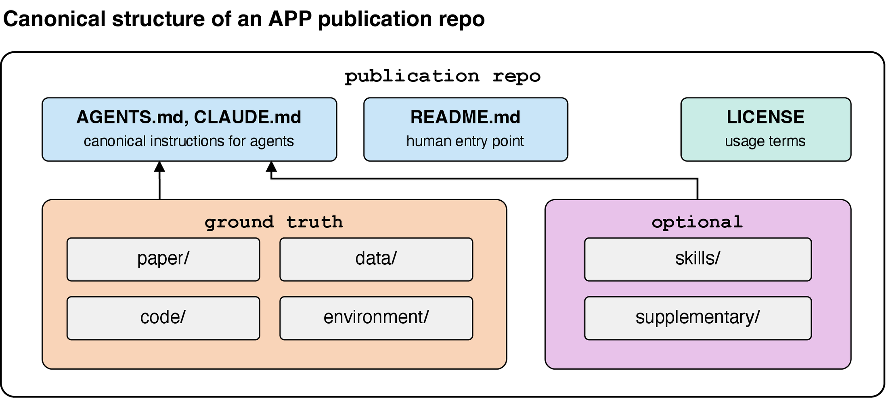
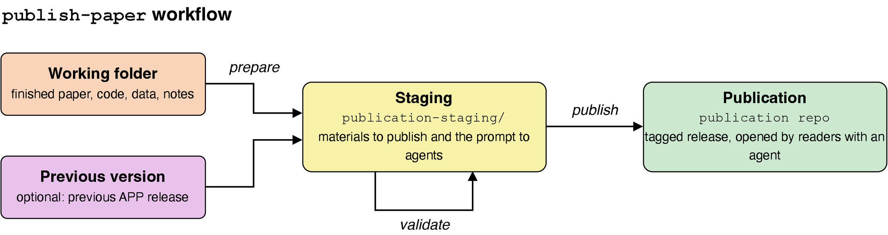
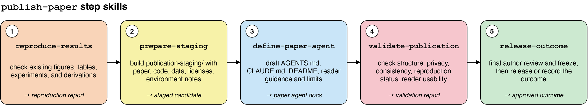

# Agentic Publication Protocol (APP)

[](PROTOCOL.md)
[](https://github.com/LionSR/AgenticPublicationProtocol/releases)
[](#license)

## Motivation

In scientific research, the main product, the scientific paper, often contains only incomplete information about the work. Readers often need substantial effort to understand a paper and reproduce its results before using it in their own research. Important author know-how from the research process is often absent from the manuscript.

Recent progress in AI agents creates a new way to address this problem: instead of only publishing a paper, **publish an agent**. If every publication comes with an agent that can explain the paper, help readers reproduce the results, and even support follow-up work, each user can access a faithful and thorough representation of the scientific work. This can accelerate research and enable forms of scientific collaboration that were not previously possible.

## What is APP

APP is an interactive format for authors to publish an AI agent together with research artifacts such as the paper, code, data, and related context. The bundle is a GitHub repository that users can open with any AI coding agent that reads `AGENTS.md`. The repo carries the paper alongside the code, data, and context needed for the agent to explain the work, reproduce figures, run experiments, and answer questions — more of what the research actually contains than a static manuscript can convey. The repo may also contain author-developed agent skills that are useful for understanding the work. A verified APP publication is a tagged public release with `AGENTS.md` plus an `APP_PUBLICATION.json` release manifest tying the release to validation and author approval. The structure of the published repository is illustrated below.



Readers clone the repo, open it in [Claude Code](https://claude.ai/claude-code), [Codex](https://github.com/openai/codex), or any other agent that reads [`AGENTS.md`](https://agents.md), and the agent speaks for the paper.

Authors who plan to publish their paper in APP format can use the `publish-paper` skill. It orchestrates modular step skills that help authors reproduce/check existing results, organize publication materials, draft the `AGENTS.md` instructions, validate the publication, and carry out the final release or developer-sandbox outcome. The `publish-paper` workflow is shown below.



APP helps organize and reproduce/check results authors have already produced. It does not provide AI tools for improving the paper's scientific claims, adding new experiments, or carrying out new research.

This repository contains:

- [`PROTOCOL.md`](PROTOCOL.md) — the specification of what an APP publication looks like.
- [`skills/`](skills/) — official APP skills, including `publish-paper`, `reproduce-results`, `prepare-staging`, `define-paper-agent`, `validate-publication`, `release-outcome`, `extract-chat-context`, `create-paper-page`, and `load-paper`.
- [`template/`](template/) — starter files the skills adapt:
  - [`template/AGENTS.md`](template/AGENTS.md) — starter for the publication's `AGENTS.md`.
  - [`template/README.md`](template/README.md) — starter for the publication's human-facing `README.md`.
  - [`template/CLAUDE.md`](template/CLAUDE.md) — one-line Claude Code import (`@AGENTS.md`).
  - [`template/publications.md`](template/publications.md) — template for the working repo's `.publications.md` release log.
- [`assets/readme/`](assets/readme/) — images used by this README.
- [`.agents/`](.agents/), [`.claude-plugin/`](.claude-plugin/), and [`.codex-plugin/`](.codex-plugin/) — marketplace and plugin metadata for Codex and Claude Code.
- [`CONTRIBUTING.md`](CONTRIBUTING.md) — how to propose changes to the protocol, templates, and official skills.
- [`LICENSE`](LICENSE) — license terms for the protocol, skills, and templates.

## Install and Update

First make sure the agent itself is installed. APP runs *inside* an AI coding agent — it is not a standalone program. Install [Claude Code](https://claude.ai/claude-code) or [Codex](https://github.com/openai/codex) first, then follow the matching section below.

### Claude Code

These are slash commands. Type them **inside a running Claude Code session** (at the Claude Code prompt), not in your shell. Press Enter after each line to install APP:

```
/plugin marketplace add LionSR/AgenticPublicationProtocol
/plugin install paper-protocol@paper-protocol
/reload-plugins
```

If you haven't started a session yet, run `claude` in your terminal first, then enter the commands above. (`/reload-plugins` activates the plugin in the current session; the `paper-protocol@paper-protocol` form is `plugin-name@marketplace-name`, not a typo.) When it works, the plugin's skills such as `/publish-paper` become available — see [Publish a paper](#publish-a-paper) for the next step.

To update an existing Claude Code install, type this inside Claude Code:

```
/plugin marketplace update paper-protocol
/reload-plugins
```

New skills, reference files, and templates appear after update; you do not need to reinstall the plugin.

### Codex

These are shell commands. Run them in your **terminal** (your normal shell prompt), not inside Codex. First register the marketplace, then install the plugin:

```bash
codex plugin marketplace add LionSR/AgenticPublicationProtocol
codex plugin add paper-protocol@paper-protocol
```

`codex plugin add` may prompt you to authenticate on install. (`paper-protocol@paper-protocol` is `plugin-name@marketplace-name`, not a typo.) You can also install and toggle plugins interactively: open Codex, find `Agentic Publication Protocol` in the plugin browser, and press Space to enable it. Once enabled, its skills such as `$publish-paper` become available — see [Publish a paper](#publish-a-paper) for the next step.

To update an existing Codex install, run this in your terminal:

```bash
codex plugin marketplace upgrade paper-protocol
```

New skills, reference files, and templates appear after update; you do not need to reinstall the plugin.

### Manual install

Use this path when you want to load the skills directly rather than installing the plugin. First clone this repo locally. Use HTTPS if you do not have GitHub SSH keys set up:

```bash
git clone https://github.com/LionSR/AgenticPublicationProtocol.git
cd AgenticPublicationProtocol
```

Or use SSH if your GitHub account is configured for SSH:

```bash
git clone git@github.com:LionSR/AgenticPublicationProtocol.git
cd AgenticPublicationProtocol
```

Then point your agent at the cloned `skills/` directory.

To update a manual install, pull the latest changes in the cloned directory:

```bash
git pull
```

Then keep pointing your agent at the same `skills/` directory. New skills, reference files, and templates appear after update.

## Publish a paper

The working repo is the folder that contains the materials you want to publish. It may also contain raw materials, notes, or other context that helps explain the paper.

You need an AI coding agent that can read APP skills and operate in your working repo. To complete publication, the required Git and GitHub operations must also be completed, such as creating commits, tags, releases, and release assets. You can either allow the agent to perform these operations or run them manually when the skill instructs you to do so. If you want the agent to perform them, you may need to set up GitHub authentication.

Open your working repo in an AI coding agent with this plugin installed, then invoke the `publish-paper` skill:

```text
# Claude Code
/publish-paper

# Codex
$publish-paper
```

The `publish-paper` skill walks through the full workflow in order. It can span multiple sessions, and it may pause for author decisions between steps.



You can also call each step directly if you only need part of the workflow, want to resume from a known checkpoint, or are debugging a publication candidate. The step skills should be used in this order:

1. `reproduce-results` — reproduce/check existing paper results before staging, including figures, tables, experiments, and analytic derivations.
2. `prepare-staging` — organize the author-approved paper, code, data, environment notes, reproduction reports, and supplementary materials into `publication-staging/`.
3. `define-paper-agent` — draft and revise `AGENTS.md`, `CLAUDE.md`, and reader-facing documentation for the staged paper agent.
4. `validate-publication` — check APP structure, paths, privacy, consistency, reproduction status, and reader-agent usability.
5. `release-outcome` — perform the final review/freeze and either publish the validated release or record a developer-sandbox outcome.

`publish-paper` is still the recommended entry point because it keeps these steps coordinated and asks for author approval at the right checkpoints.

## Use a published paper

Clone the published paper repo and open it in an AI coding agent. Replace the placeholder URL below with the actual APP publication repository URL:

```bash
git clone https://github.com/author/their-paper.git
cd their-paper
# open in Claude Code, Codex, Cursor, or any agent that reads AGENTS.md
```

The agent reads `AGENTS.md` on startup and now speaks for the paper.

If the `load-paper` skill is installed, you can use it with a repo URL to clone or import a paper into the current project without leaving the working session.

## Skills

The skills in this repository are grouped by how essential they are to the APP workflow.

**Core publication workflow**

| Skill | What it does |
|-------|--------------|
| `publish-paper` | Orchestrate the full modular APP publication workflow. |
| `reproduce-results` | Reproduce/check existing paper results before staging, including figures, tables, experiments, and analytic derivations, without adding new results. |
| `prepare-staging` | Build the self-contained `publication-staging/` tree from author-approved materials and reproduction findings. |
| `define-paper-agent` | Draft and iterate `AGENTS.md`, `CLAUDE.md`, and README with the author. |
| `validate-publication` | Check APP structure, paths, privacy, clear factual consistency, reader-agent usability, figure/table reproduction status, and release manifest verification when applicable. |
| `release-outcome` | Perform lightweight final review/freeze and either publish the validated release or record a dev-sandbox outcome. |
| `extract-chat-context` | Pull publication-safe research context from local Claude Code / Codex chat/session history for supplementary materials. Optional helper called by `reproduce-results`. |

**Optional publication add-ons**

| Skill | What it does |
|-------|--------------|
| `create-paper-page` | Generate a GitHub Pages landing page for a published paper. Not required for APP compliance; may be offered after `publish-paper` succeeds. |

**Reader and import utility**

This is a useful companion skill, but it is not required to create or validate an APP publication.

| Skill | What it does |
|-------|--------------|
| `load-paper` | Load a published paper, local APP candidate, non-APP paper repo, or arXiv paper into the current project. Classifies APP status when possible; for arXiv inputs, fetches metadata/source, searches for associated public code, and creates a protocol-shaped local import. |

## External skills and extensions

APP publications may point to reusable skills or extensions hosted outside the publication repo, including community-maintained skill collections or individual researchers' repositories. Use `recommended_external_skills`, `app_extensions`, or the **External Skills and Extensions** section of `AGENTS.md` to record the source URL, version or tag, and purpose. Skill sources should point directly to a directory containing `SKILL.md`, preferably at a stable tag or commit.

External skills are recommendations only. They are not part of an author-approved APP publication unless they are bundled into the tagged release and covered by the publication manifest.

## Contributing

Contributions to the protocol, templates, documentation, validation behavior, and official APP workflow skills are welcome. Reusable field-specific or authoring skills can also live in independent repositories and be referenced from APP publications. See [`CONTRIBUTING.md`](CONTRIBUTING.md) for the boundary between official APP repo changes and external skill contributions.

## License

`PROTOCOL.md`: CC-BY-4.0. Skills and templates: MIT.
